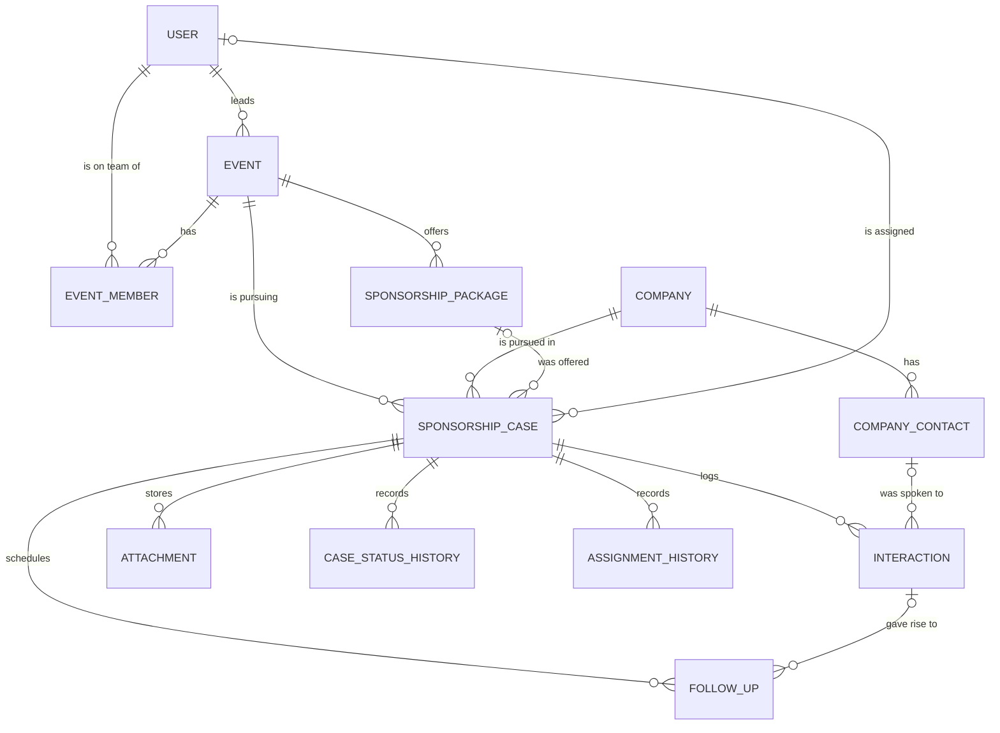

# SponsorSync — what the finished system does

One page describing the whole product across all four plans, so an owner picking up Plan 2, 3, or
4 can see where their piece sits. For who builds what and when, see `docs/team-model.md`.

## The problem

A team runs events and needs corporate sponsors for them. Today that lives in a spreadsheet and a
WhatsApp group, and it fails in four specific ways:

1. **Two members contact the same company**, who then receives two different pitches at two
   different prices.
2. **Follow-ups are forgotten.** "Call them back in a week" is written somewhere nobody re-reads.
3. **Last year's knowledge evaporates.** The team turns over, and next year starts from zero
   instead of from a list of companies that already said yes.
4. **Nobody can answer "how are we doing"** without rebuilding a spreadsheet by hand.

Everything in the four plans exists to close one of those four. When a feature does not map to one
of them, it is scope creep.

## The shape

**The sponsorship case is the centre of the system.** It is one company being pursued for one
event — unique on `(event_id, company_id)` — and it owns the status, the money, the assigned
member, and all the activity history. Everything else either feeds it or reports on it.

Two rules in that diagram matter more than they look:

- **A company is not owned by an event.** `companies` and `company_contacts` are a permanent
  directory reused across every event and every year. That is what makes "who sponsored us last
  year" answerable at all, and it is the single most common thing a first build gets wrong.
- **A case links to its company directly**, not through a contact. A contact who changes employer
  must not silently move a year of sponsorship history to a different company.

## The journey, end to end

### 1. An admin sets up people — Plan 1 ✅ built

Admin creates accounts and assigns one of four roles: `ADMIN`, `LEADER` (runs events), `MEMBER`
(works assigned companies), `SUPERVISOR` (watches, changes nothing). There is no public sign-up.
A forgotten password is reset by an admin, not by email — see `docs/roles-and-access.md`.

### 2. A leader creates an event and its offer — Plan 2

Name, date, category, location, **financial target**, sponsorship deadline, and the target
sectors and cities to aim at. Then the **sponsorship packages** — the standard asks, e.g.
_Gold, 5000, logo on the stage backdrop and two booth passes_. Packages are optional; a bespoke
ask is normal.

A package is **not a product**. Nothing in SponsorSync is sold, there is no catalogue, no
inventory, and no prizes. A package is just a named, reusable version of "this is what we ask
for, and this is what the sponsor gets in return" so the team stops typing arbitrary numbers and
then forgetting what was promised.

The leader adds members and supervisors to the event team. Global role says what a person may
do; event membership says which events they may see.

### 3. Anyone builds the company directory — Plan 2

Companies carry sector, city, website, and normalized fields used for matching; each has
contacts with name, position, email, phone, and preferred contact method, one marked primary.

**Duplicates are caught at entry.** Typing a name or website fires a live check, and a
high-confidence match blocks creation unless an authorised user overrides with a written reason.
This is the whole point of a shared directory — three people entering "Zain", "Zain Jordan" and
"zain telecom" destroys the history the recommendation engine later depends on.

### 4. The leader builds the target list — Plan 3

The leader adds companies from the directory to the event. Each becomes a **sponsorship case**,
starting `UNASSIGNED`, optionally tagged with the package being offered and a requested amount.
Expect 50–60 per event: most companies never reply, and the pipeline is sized for that.

### 5. Cases are assigned — Plan 3

The leader assigns a case to a member, or a member **claims** an unassigned one. Claiming is a
single atomic conditional update, so two members hitting the button together produce exactly one
winner and one `409`. This is the direct fix for failure #1, and it is stricter than the
commercial CRMs, which rely on convention rather than the database.

Nothing about assignment can strand a record. A member cannot be removed from an event, a user
cannot be deactivated, and a company cannot be archived while active cases depend on them —
each returns `409` naming what is blocking, and requires an explicit reassignment first.

### 6. The member works the case — Plan 3

They log an **interaction** for every touch: call, email, WhatsApp, meeting, proposal sent,
company response, internal note. From an interaction they schedule a **follow-up** — a real task
with a due date and an assignee, not a date field that gets overwritten.

Overdue is computed at read time (`due_at < now()`), never stored. Notifications are generated on
demand when a user logs in or opens their queue, deduplicated by a deterministic key. There is no
cron job, because the backend does not run continuously.

That is failure #2 closed.

### 7. The case advances — Plan 3

Status moves through a controlled pipeline: contacted → waiting → proposal sent → negotiation →
pending approval → approved → contract signed → contribution received.

**Money in SponsorSync only ever moves one way: a sponsor contributes to fund an event.** There
are no purchases, no payments out, no invoicing engine, and no accounting. What is tracked is
simply how firm a number is, in four fields that never overwrite each other:

| Field              | Meaning                              |
| ------------------ | ------------------------------------ |
| `requested_amount` | what the team asked this company for |
| `offered_amount`   | what the company said it would give  |
| `approved_amount`  | what was agreed                      |
| `received_amount`  | what actually arrived                |

They are separate because the gap between them is the interesting part — "we asked 40 companies
for 5000 each, 12 offered something, 8 agreed, 5 have actually paid" is the story of an event.
Summed against `events.financial_target`, that is the progress bar. Non-cash sponsorship (a
company providing catering, venue, or printing instead of money) carries a description and an
estimated value, kept separate from cash so the two are never silently added together.

**Every transition writes a history row.** That is what makes "how long from first contact to
approval" answerable later. A case that ends in `DECLINED` must carry a reason code, and
`NO_RESPONSE` is a first-class one — a company that ghosted is not a company that said no.

### 8. Everyone sees where they stand — Plan 4

Role-specific dashboards: target progress, pipeline by status, overdue follow-ups, inactive
cases, member workload, a transparent leaderboard scored on published rules. Excel and PDF
exports. A **loss-reason report** answering why sponsors were lost, which is the question a
spreadsheet cannot answer.

That is failure #4 closed.

### 9. Next year starts warm — Plan 4

The **recommendation engine** ranks directory companies for a new event: sector and city match
against the event's targets, previous approvals, historical value, recency, and — crucially —
_why_ previous declines happened, since "no budget this quarter" and "we don't sponsor student
events" are opposite signals. Every score comes with its reasons shown.

That is failure #3 closed, and it is the feature that only works because of decisions made two
plans earlier: a permanent company directory, cross-event case history, and decline reason codes.

## Where the plan boundaries fall

|                    | Plan 2                                                                   | Plan 3                                                                                                           | Plan 4                                        |
| ------------------ | ------------------------------------------------------------------------ | ---------------------------------------------------------------------------------------------------------------- | --------------------------------------------- |
| **Owns**           | events, event_members, sponsorship_packages, companies, company_contacts | sponsorship_cases, assignment_history, case_status_history, interactions, follow_ups, attachments, notifications | no new domain tables; indexes and read models |
| **Delivers**       | the two directories all work depends on                                  | the operational workflow — the product's actual value                                                            | decision support and delivery                 |
| **Must hand over** | package-is-a-template rule; leadership can be transferred                | `CASE_STATUS_RANK`; verified `case_status_history`                                                               | —                                             |

Plan 3 modifies three Plan 2 / Plan 1 services to add orphan guards. That is expected and
specified — it is not scope creep, and it is why the plans run in this order.

## Deliberate exclusions

Named so nobody builds them by accident, and so they read as considered in the defence:

- **Fulfilment tracking** after a sponsor signs. Commercial products create a row per promised
  benefit; SponsorSync stops at `CONTRIBUTION_RECEIVED` and records promises as package benefits
  text. The clearest candidate for future work.
- **Sales stage and contract status are one field**, not two as commercial products do.
  `received_amount` carries payment state separately, which is enough at this scale.
- **No mail sending** of any kind, and nothing in the product needs it.
- **No company merge** — duplicates are prevented at entry rather than fixed afterwards.
- **Single currency (JOD)**, no currency column anywhere.
- No payments, no signatures, no sponsor-facing portal, no ML model. See Plan 4's exclusions.
